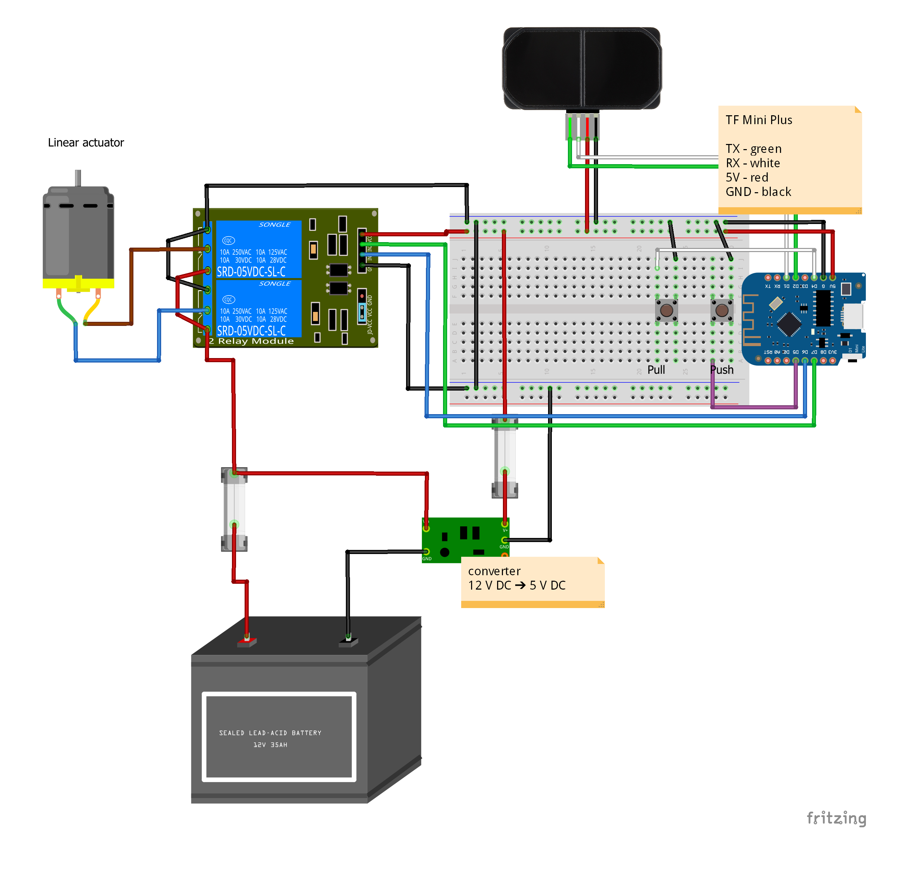

# Chicken house hatch

## Introduction
Chicken house hatch is an example of adapted IoT. It all started as an expressed need of automation for the hatch of a chicken house. In the particular area, roosters weren't allowed to make their morning sounds before 8 A.M. The most peaceful solution was to be able to open/close the hatch remotely via a home automation system, Home Assistant.

This  setup is constituted of

* a PLC (ESP8266/D1 mini with wifi)
* a 12 volt DC / 2 ampere linear actuator
* a 2 relay module
* 2 switch buttons
* a hatch for closing/opening the entrance, constructed as a guillotine

Software

The managing software is developeped as a standard Arduino application and written in C++. Architecturally, it is set up as a state machine. For remote controlling puposes, there is a REST-API as well. State changes are reported as MQTT messages.

## Communication
The actuator can be controlled via either direct switches or remotely via http endpoints.

### Devive info
	example: [link](http://10.0.0.71/info)
	

### Controlling

_server.on("/", [this]() { routeGetControl(); });
<table>
    <thead>
        <tr><td>Action</td><td>Request (GET)</td></tr>
    </thead>
    <tbody>
        <tr><td>Close hatch</td><td>//10.0.0.71/actuatorCloseHatch</td></tr>
        <tr><td>Open hatch</td><td>//10.0.0.71/actuatorOpenHatch</td></tr>
    </tbody>
</table>

<table>
    <thead>
        <tr><td>Action</td><td>Request (GET)</td></tr>
    </thead>
    <tbody>
        <tr><td>Contracting actuator piston</td><td>//10.0.0.71/actuatorPull</td></tr>
        <tr><td>Stop actuator engine</td><td>//10.0.0.71/actuatorTurnOff</td></tr>
        <tr><td>Extends actuator piston</td><td>//10.0.0.71/actuatorPush</td></tr>
    </tbody>
</table>

### Reporting
Actions/statuses can be reported to a MQTT broker if such is defined in SettingsData.h.  This file is not in Github for obvious reasons. <i>Example: </i> 
<figure>
<pre>
#ifndef SETTINGS_DATA_H
#define SETTINGS_DATA_H

String SETTINGS_DATA_FIRMWARE_VERSION = "2021-03-29";
int SETTINGS_DATA_SERIAL_MONITOR_BAUD = 115200;

bool ACTUATOR_PULL_WILL_OPEN_HATCH = true;

// WiFi credentials
String CREDENTIALS_JSON_STRING = "["
	"{"
		"\"SSID\": \"&lt;SSID1&gt;\","
		"\"password\": \"&lt;password for wifi>\"},"
	"{"
		"\"SSID\": \"&lt;SSID 2&gt;\","
		"\"password\": \"&lt;password for wifi 2&gt;\"}"
"]";

// Web server
int SETTINGS_DATA_WEB_SERVER_PORT = 80;

// MQTT Broker
String SETTINGS_DATA_MQTT_BROKER_URL = "10.0.0.6";
String SETTINGS_DATA_MQTT_TOPIC_SUBSCRIBE = "iot/hen_house/hatch/to";
String SETTINGS_DATA_MQTT_TOPIC_PUBLISH = "iot/hen_house/hatch/from";
String SETTINGS_DATA_MQTT_USERNAME = "&lt;username for MQTT-broker&gt;";
String SETTINGS_DATA_MQTT_PASSWORD = "&lt;username for MQTT-broker&gt;";
int SETTINGS_DATA_MQTT_PORT = 1883;

#endif
</pre>

  <figcaption><code>SettingsData.h</code></figcaption>
</figure>

# Setup

## Status

Different statuses are indicated with the blue online LED. Different statuses are indicated by different statuses 
<table>
    <thead>
        <tr><td>Action</td><td>Request (GET)</td></tr>
    </thead>
    <tbody>
        <tr><td>error state</td><td>3 short blinks every second</td></tr>
        <tr><td>on http request</td><td>2 short blinks</td></tr>
        <tr><td>on performing action</td><td>1 short blink every second</td></tr>
        <tr><td>stand by</td><td>1 short blink every 5 s</td></tr>
        <tr><td>stand by no wifi</td><td>3 short blinks 5 s</td></tr>
    </tbody>
</table>